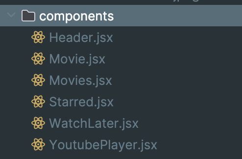
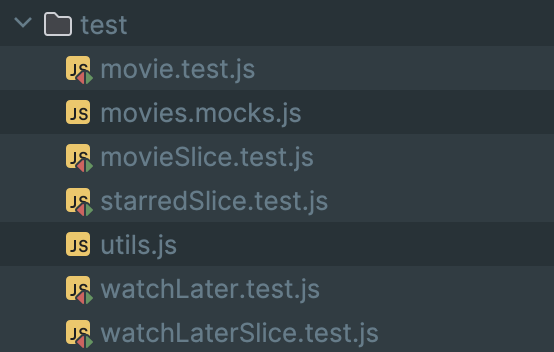
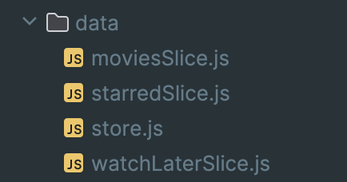
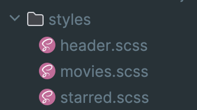
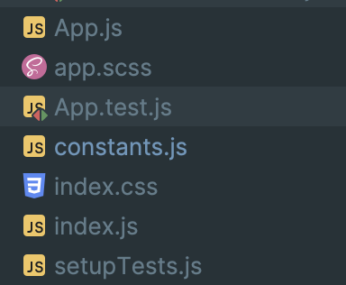
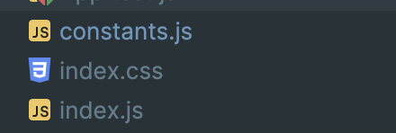
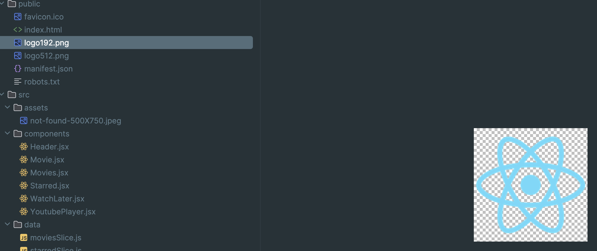

# General review notes

1. All components are currently in a flat folder. Instead, consider colocating each component in its own folder.

2. The **test/** folder is isolated. It’s more maintainable to colocate tests with the components or features they test.

3. The **data/** folder is too generic. Rename it to **store/** .

4. SCSS files are separated by component but not colocated. Prefer to colocate styles next to components. In the future, we can try to use CSS modules to avoid global conflicts.

5. Files like **App.js, app.scss, App.test.js, and constants.js** are mixed at the root level. Group related files into **app/**, **shared/** .

6. If you’re using SCSS for everything else, consider converting it to **index.scss**.

7. I would recommend changing the logo and favicon icons to match the app.

## Some basic recommendations for refactoring
1.	**Add a Linter and Formatter**
Introduce ESLint (with recommended React rules) and Prettier to enforce consistent code style and catch potential issues early.
2.	**Use TypeScript**
Migrate the codebase to TypeScript. 